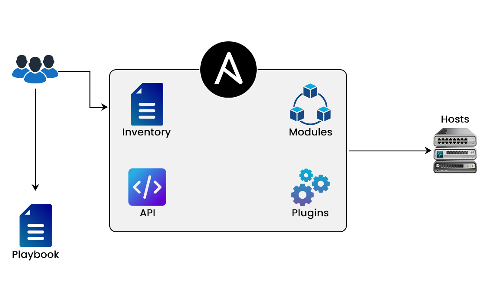
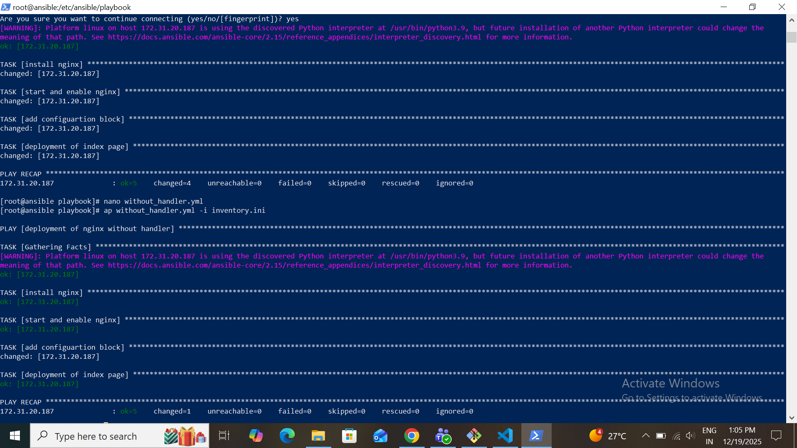
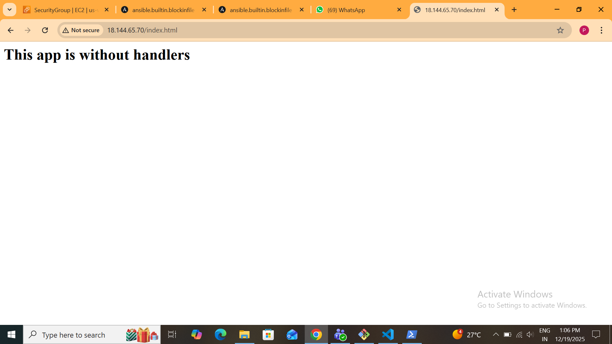
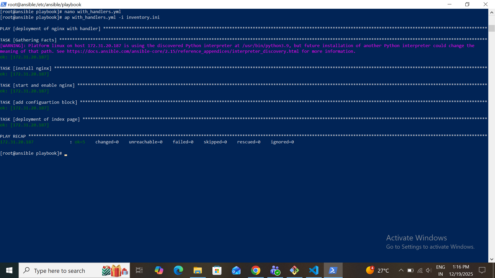
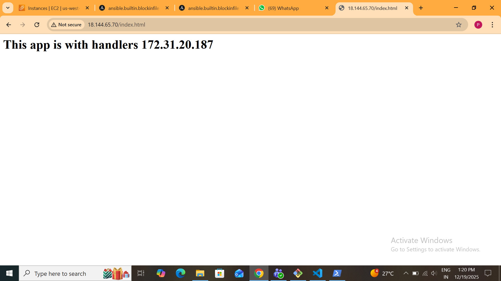

# Without-And-With-Handler-Project-Using-Ansible-Inventory

## Introduction

Ansible is a popular configuration management and automation tool widely used in DevOps.
One of the most powerful features of Ansible is Handlers, which help manage services efficiently.

This project demonstrates the difference between playbooks executed without handlers and with handlers using NGINX web server and an inventory file.

The project clearly explains why handlers are important and how they improve automation quality in real-world environments.

## Project Objective

The objectives of this project are:
- Launch 2 EC2 Instances 

- To understand the concept of handlers in Ansible

- To compare execution behavior with and without handlers

- To automate NGINX installation and service management

- To follow Ansible best practices using inventory-based execution

## Technologies and Tools Used

- Ansible

- NGINX Web Server

- Linux OS (Amazon Linux)

- Inventory File

- SSH Key-based Authentication

## Project Structure
    
    Without-And-With-Handler-Project-Using-Ansible-Inventory
    │
    ├── inventory
    ├── without_handler.yml
    ├── with_handler.yml
    └── README.md
    |_Img/

## Project Architecture

#### - Control Node
 
  Machine where Ansible is installed and playbooks are executed

#### - Managed Node (Target Server)

Remote server where NGINX is installed and managed

#### - Inventory File

Contains target server IP and connection details

Ansible communicates with the managed node using SSH.

## EC2 Instances:

Launched a Two EC2 Instances

## Inventory File Explanation

The inventory file defines the target server details.

Example:

    [targetserver]
    172.31.20.187 ansible_user=ec2-user ansible_ssh_private_key_file=jenkins2.pem

## Explanation:

 - targetserver → Host group name

- IP Address → Target server IP

- ansible_user → Remote user

- ansible_ssh_private_key_file → SSH private key

## Playbook Without Handler (NGINX)

###  Description

In this playbook:

- NGINX is installed on the target server

- NGINX service is restarted using a normal task

- Service restarts every time the playbook runs, even if no change occurs.

##  Execution Command

    ansible-playbook without_handler.yml -i inventory 

## Output Of Wuthout-Handler File

### Observation

- NGINX service restarts every time

- Even if no configuration change is done

- Task status shows changed on every run

- This behavior is not optimized

## Playbook With Handler (NGINX)
###  Description

In this playbook:

- NGINX is installed

- Configuration changes notify a handler

- NGINX service restarts only when required

- Uses notify and handlers

## Execution Command

    ansible-playbook with_handler.yml-i inventory 

    

## Output Of With-Handler File

### Advantages

- Optimized execution

- No unnecessary restarts

- Better performance

- Follows idempotent behavior

- Production-ready automation

## Difference Between Without Handler and With Handler

| Without Handler          | With Handler                  |
| ------------------------ | ----------------------------- |
| NGINX restarts every run | NGINX restarts only on change |
| Inefficient execution    | Optimized execution           |
| Not production-safe      | Best practice                 |
| No notify mechanism      | Uses notify & handlers        |

## Output Observation

- In without handler playbook, NGINX service status shows restart on every run

- In with handler playbook, restart happens only when configuration is changed

- Ansible output clearly shows changed vs ok status

## Key Learnings

- What are handlers in Ansible

- How notify triggers handlers

- Importance of idempotency

- Efficient service management using NGINX

- Real-world automation best practices

## Real-World Use Case

- Web server automation

- Configuration management

- Service restart optimization

- Production-grade Ansible deployments

## Conclusion

Handlers are an essential part of Ansible automation.
By using handlers with NGINX, services restart only when required, making the automation process efficient and reliable.

This project clearly demonstrates why handlers should always be used in real-world DevOps environments.

## Author

Pooja Jadhav